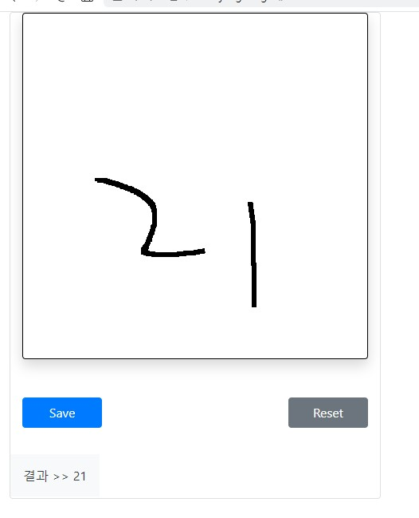

## 씨애랑 소프트웨어 전시회 - 코어 팀

### 팀원소개
- 허홍준 (18, 씨애랑)
- 허남정 (20)

### Abstract Map

### 사용기술
- BackEnd
    - 
- AI
  - 
  - 
- FrontEnd
  - </a>
  - </a>
  - </a>
### 참고(reference) 목록
- 참고 ajax로 파일(multpart/form-data) 전송하기: https://dorongdogfoot.tistory.com/144

### 작동화면

